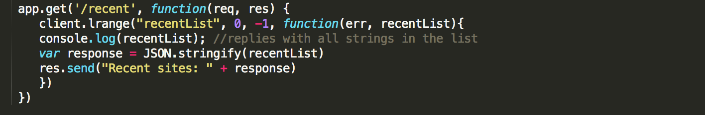
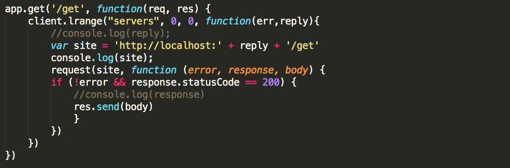

##Infrastructure fluency (DevOps HW 3)
=========================
Name: Tejal Raut

Unity ID: traut

Implementation (Option2)

### Setup

* The simple web servers are configured on localhost:3003 and localhost:3004
* The proxy is set on localhost:3007

### Web server working
A simple web server is set as:

The following functions are implemented for a simple web server:

* *set*

When `/set` is visited, a new key is set with the value:
> "this message will self-destruct in 10 seconds"

A message 'set function. key is set' is shown to the client. Code snippet:

* *get*

When `/get` is visited, the key is fetched, and value is sent back to the client. After the key is expired, it displays null to the client. The code snippet implementing this function is:

* *recent*

When `/recent`is visited, the most recently visited 5 sites are displayed. The hook is implemented as follows:

The recent function is implemented as:

* *upload*

Images can be uploaded to any of the web server using the command:
	
	curl -F "image=@./img/morning.jpg" localhost:300(3/4)/upload

A post function is implemented to handle the post request to the web server.

* *meow*

`/meow` displays the most recent uploaded image to the client. The function is implemented as:

* *remove*

`/remove` removes the image from the queue and displays 

### Redis
Redis client is configured as:

	var redis = require('redis')
	var client = redis.createClient(6379, '127.0.0.1', {})

### Proxy server

The proxy server is implemented in the proxy.js file. It swaps between the two servers. The part of the code which does this:

The various requests for the various functions (/get, /set, /recent etc.) are handled by the proxy server and directed to the two web servers alternately. A code snippet for one of the functions is as follows. Similarly, the other function implementations can be found in proxy.js file.

